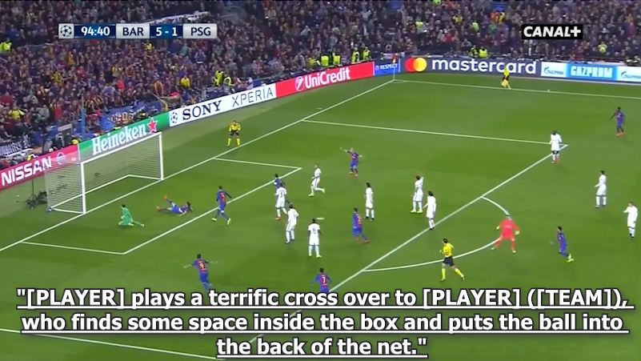

# SoccerNet Dense Video Captioning 

The task of Dense Video Captioning consists in generating engaging caption describing soccer actions and localizing each caption with a timestamp. For that, we provide 471 videos from soccer broadcast games available at two resolutions (720p and 224p) with captions. We also provide extracted features at 2 frames per second for lighter models, including the feature provided by the 2021 action spotting challenge winners, Baidu Research. The provided data also includes original comments and versions where referees, coaches, players, and teams have been anonymized or identified, as well as team lineups. The challenge set is composed of 42 separate games.

Participate in the 2024 edition of our Dense Video Captioning Challenge on our [Evaluation Server](https://eval.ai/web/challenges/challenge-page/2199/overview).

This repository provides a first [Baseline](Benchmarks/TemporallyAwarePooling/) method and code for participants to get started.

<p align="center"></p>

### 2023 Challenge Leaderboard

<p><table class="dataframe">
  <thead>
    <tr style="text-align: right;">
      <th style = "background-color: #FFFFFF;font-family: Century Gothic, sans-serif;font-size: medium;color: #305496;text-align: left;border-bottom: 2px solid #305496;padding: 0px 20px 0px 0px;width: auto">Team</th>
      <th style = "background-color: #FFFFFF;font-family: Century Gothic, sans-serif;font-size: medium;color: #305496;text-align: left;border-bottom: 2px solid #305496;padding: 0px 20px 0px 0px;width: auto">METEOR</th>
      <th style = "background-color: #FFFFFF;font-family: Century Gothic, sans-serif;font-size: medium;color: #305496;text-align: left;border-bottom: 2px solid #305496;padding: 0px 20px 0px 0px;width: auto">Bleu_1</th>
      <th style = "background-color: #FFFFFF;font-family: Century Gothic, sans-serif;font-size: medium;color: #305496;text-align: left;border-bottom: 2px solid #305496;padding: 0px 20px 0px 0px;width: auto">Bleu_2</th>
      <th style = "background-color: #FFFFFF;font-family: Century Gothic, sans-serif;font-size: medium;color: #305496;text-align: left;border-bottom: 2px solid #305496;padding: 0px 20px 0px 0px;width: auto">Bleu_3</th>
      <th style = "background-color: #FFFFFF;font-family: Century Gothic, sans-serif;font-size: medium;color: #305496;text-align: left;border-bottom: 2px solid #305496;padding: 0px 20px 0px 0px;width: auto">Bleu_4</th>
      <th style = "background-color: #FFFFFF;font-family: Century Gothic, sans-serif;font-size: medium;color: #305496;text-align: left;border-bottom: 2px solid #305496;padding: 0px 20px 0px 0px;width: auto">ROUGE_L</th>
      <th style = "background-color: #FFFFFF;font-family: Century Gothic, sans-serif;font-size: medium;color: #305496;text-align: left;border-bottom: 2px solid #305496;padding: 0px 20px 0px 0px;width: auto">CIDEr</th>
      <th style = "background-color: #FFFFFF;font-family: Century Gothic, sans-serif;font-size: medium;color: #305496;text-align: left;border-bottom: 2px solid #305496;padding: 0px 20px 0px 0px;width: auto">Recall</th>
      <th style = "background-color: #FFFFFF;font-family: Century Gothic, sans-serif;font-size: medium;color: #305496;text-align: left;border-bottom: 2px solid #305496;padding: 0px 20px 0px 0px;width: auto">Precision</th>
    </tr>
  </thead>
  <tbody>
    <tr>
      <td style = "background-color: #D9E1F2;font-family: Century Gothic, sans-serif;font-size: medium;text-align: left;padding: 0px 20px 0px 0px;width: auto">OPPO - VideoText</td>
      <td style = "background-color: #D9E1F2;font-family: Century Gothic, sans-serif;font-size: medium;text-align: left;padding: 0px 20px 0px 0px;width: auto">26.66</td>
      <td style = "background-color: #D9E1F2;font-family: Century Gothic, sans-serif;font-size: medium;text-align: left;padding: 0px 20px 0px 0px;width: auto">35.55</td>
      <td style = "background-color: #D9E1F2;font-family: Century Gothic, sans-serif;font-size: medium;text-align: left;padding: 0px 20px 0px 0px;width: auto">31.03</td>
      <td style = "background-color: #D9E1F2;font-family: Century Gothic, sans-serif;font-size: medium;text-align: left;padding: 0px 20px 0px 0px;width: auto">28.13</td>
      <td style = "background-color: #D9E1F2;font-family: Century Gothic, sans-serif;font-size: medium;text-align: left;padding: 0px 20px 0px 0px;width: auto">25.65</td>
      <td style = "background-color: #D9E1F2;font-family: Century Gothic, sans-serif;font-size: medium;text-align: left;padding: 0px 20px 0px 0px;width: auto">33.23</td>
      <td style = "background-color: #D9E1F2;font-family: Century Gothic, sans-serif;font-size: medium;text-align: left;padding: 0px 20px 0px 0px;width: auto">69.73</td>
      <td style = "background-color: #D9E1F2;font-family: Century Gothic, sans-serif;font-size: medium;text-align: left;padding: 0px 20px 0px 0px;width: auto">24.59</td>
      <td style = "background-color: #D9E1F2;font-family: Century Gothic, sans-serif;font-size: medium;text-align: left;padding: 0px 20px 0px 0px;width: auto">68.59</td>
    </tr>
    <tr>
      <td style = "background-color: white; color: black;font-family: Century Gothic, sans-serif;font-size: medium;text-align: left;padding: 0px 20px 0px 0px;width: auto">HZC</td>
      <td style = "background-color: white; color: black;font-family: Century Gothic, sans-serif;font-size: medium;text-align: left;padding: 0px 20px 0px 0px;width: auto">21.3</td>
      <td style = "background-color: white; color: black;font-family: Century Gothic, sans-serif;font-size: medium;text-align: left;padding: 0px 20px 0px 0px;width: auto">29.73</td>
      <td style = "background-color: white; color: black;font-family: Century Gothic, sans-serif;font-size: medium;text-align: left;padding: 0px 20px 0px 0px;width: auto">24.52</td>
      <td style = "background-color: white; color: black;font-family: Century Gothic, sans-serif;font-size: medium;text-align: left;padding: 0px 20px 0px 0px;width: auto">21.44</td>
      <td style = "background-color: white; color: black;font-family: Century Gothic, sans-serif;font-size: medium;text-align: left;padding: 0px 20px 0px 0px;width: auto">19.13</td>
      <td style = "background-color: white; color: black;font-family: Century Gothic, sans-serif;font-size: medium;text-align: left;padding: 0px 20px 0px 0px;width: auto">24.56</td>
      <td style = "background-color: white; color: black;font-family: Century Gothic, sans-serif;font-size: medium;text-align: left;padding: 0px 20px 0px 0px;width: auto">24.76</td>
      <td style = "background-color: white; color: black;font-family: Century Gothic, sans-serif;font-size: medium;text-align: left;padding: 0px 20px 0px 0px;width: auto">98.68</td>
      <td style = "background-color: white; color: black;font-family: Century Gothic, sans-serif;font-size: medium;text-align: left;padding: 0px 20px 0px 0px;width: auto">51.19</td>
    </tr>
    <tr>
      <td style = "background-color: #D9E1F2;font-family: Century Gothic, sans-serif;font-size: medium;text-align: left;padding: 0px 20px 0px 0px;width: auto">Baseline 2</td>
      <td style = "background-color: #D9E1F2;font-family: Century Gothic, sans-serif;font-size: medium;text-align: left;padding: 0px 20px 0px 0px;width: auto">21.25</td>
      <td style = "background-color: #D9E1F2;font-family: Century Gothic, sans-serif;font-size: medium;text-align: left;padding: 0px 20px 0px 0px;width: auto">30.01</td>
      <td style = "background-color: #D9E1F2;font-family: Century Gothic, sans-serif;font-size: medium;text-align: left;padding: 0px 20px 0px 0px;width: auto">24.80</td>
      <td style = "background-color: #D9E1F2;font-family: Century Gothic, sans-serif;font-size: medium;text-align: left;padding: 0px 20px 0px 0px;width: auto">21.74</td>
      <td style = "background-color: #D9E1F2;font-family: Century Gothic, sans-serif;font-size: medium;text-align: left;padding: 0px 20px 0px 0px;width: auto">19.44</td>
      <td style = "background-color: #D9E1F2;font-family: Century Gothic, sans-serif;font-size: medium;text-align: left;padding: 0px 20px 0px 0px;width: auto">24.65</td>
      <td style = "background-color: #D9E1F2;font-family: Century Gothic, sans-serif;font-size: medium;text-align: left;padding: 0px 20px 0px 0px;width: auto">25.68</td>
      <td style = "background-color: #D9E1F2;font-family: Century Gothic, sans-serif;font-size: medium;text-align: left;padding: 0px 20px 0px 0px;width: auto">98.68</td>
      <td style = "background-color: #D9E1F2;font-family: Century Gothic, sans-serif;font-size: medium;text-align: left;padding: 0px 20px 0px 0px;width: auto">51.21</td>
    </tr>
    <tr>
      <td style = "background-color: white; color: black;font-family: Century Gothic, sans-serif;font-size: medium;text-align: left;padding: 0px 20px 0px 0px;width: auto">justplay</td>
      <td style = "background-color: white; color: black;font-family: Century Gothic, sans-serif;font-size: medium;text-align: left;padding: 0px 20px 0px 0px;width: auto">21.2</td>
      <td style = "background-color: white; color: black;font-family: Century Gothic, sans-serif;font-size: medium;text-align: left;padding: 0px 20px 0px 0px;width: auto">29.83</td>
      <td style = "background-color: white; color: black;font-family: Century Gothic, sans-serif;font-size: medium;text-align: left;padding: 0px 20px 0px 0px;width: auto">24.68</td>
      <td style = "background-color: white; color: black;font-family: Century Gothic, sans-serif;font-size: medium;text-align: left;padding: 0px 20px 0px 0px;width: auto">21.66</td>
      <td style = "background-color: white; color: black;font-family: Century Gothic, sans-serif;font-size: medium;text-align: left;padding: 0px 20px 0px 0px;width: auto">19.38</td>
      <td style = "background-color: white; color: black;font-family: Century Gothic, sans-serif;font-size: medium;text-align: left;padding: 0px 20px 0px 0px;width: auto">24.34</td>
      <td style = "background-color: white; color: black;font-family: Century Gothic, sans-serif;font-size: medium;text-align: left;padding: 0px 20px 0px 0px;width: auto">25.89</td>
      <td style = "background-color: white; color: black;font-family: Century Gothic, sans-serif;font-size: medium;text-align: left;padding: 0px 20px 0px 0px;width: auto">98.68</td>
      <td style = "background-color: white; color: black;font-family: Century Gothic, sans-serif;font-size: medium;text-align: left;padding: 0px 20px 0px 0px;width: auto">50.99</td>
    </tr>
    <tr>
      <td style = "background-color: #D9E1F2;font-family: Century Gothic, sans-serif;font-size: medium;text-align: left;padding: 0px 20px 0px 0px;width: auto">aisoccer</td>
      <td style = "background-color: #D9E1F2;font-family: Century Gothic, sans-serif;font-size: medium;text-align: left;padding: 0px 20px 0px 0px;width: auto">21.02</td>
      <td style = "background-color: #D9E1F2;font-family: Century Gothic, sans-serif;font-size: medium;text-align: left;padding: 0px 20px 0px 0px;width: auto">29.53</td>
      <td style = "background-color: #D9E1F2;font-family: Century Gothic, sans-serif;font-size: medium;text-align: left;padding: 0px 20px 0px 0px;width: auto">24.42</td>
      <td style = "background-color: #D9E1F2;font-family: Century Gothic, sans-serif;font-size: medium;text-align: left;padding: 0px 20px 0px 0px;width: auto">21.42</td>
      <td style = "background-color: #D9E1F2;font-family: Century Gothic, sans-serif;font-size: medium;text-align: left;padding: 0px 20px 0px 0px;width: auto">19.15</td>
      <td style = "background-color: #D9E1F2;font-family: Century Gothic, sans-serif;font-size: medium;text-align: left;padding: 0px 20px 0px 0px;width: auto">24.31</td>
      <td style = "background-color: #D9E1F2;font-family: Century Gothic, sans-serif;font-size: medium;text-align: left;padding: 0px 20px 0px 0px;width: auto">23.72</td>
      <td style = "background-color: #D9E1F2;font-family: Century Gothic, sans-serif;font-size: medium;text-align: left;padding: 0px 20px 0px 0px;width: auto">98.63</td>
      <td style = "background-color: #D9E1F2;font-family: Century Gothic, sans-serif;font-size: medium;text-align: left;padding: 0px 20px 0px 0px;width: auto">50.83</td>
    </tr>
    <tr>
      <td style = "background-color: white; color: black;font-family: Century Gothic, sans-serif;font-size: medium;text-align: left;padding: 0px 20px 0px 0px;width: auto">Baseline 1</td>
      <td style = "background-color: white; color: black;font-family: Century Gothic, sans-serif;font-size: medium;text-align: left;padding: 0px 20px 0px 0px;width: auto">15.24</td>
      <td style = "background-color: white; color: black;font-family: Century Gothic, sans-serif;font-size: medium;text-align: left;padding: 0px 20px 0px 0px;width: auto">11.91</td>
      <td style = "background-color: white; color: black;font-family: Century Gothic, sans-serif;font-size: medium;text-align: left;padding: 0px 20px 0px 0px;width: auto">9.97</td>
      <td style = "background-color: white; color: black;font-family: Century Gothic, sans-serif;font-size: medium;text-align: left;padding: 0px 20px 0px 0px;width: auto">8.83</td>
      <td style = "background-color: white; color: black;font-family: Century Gothic, sans-serif;font-size: medium;text-align: left;padding: 0px 20px 0px 0px;width: auto">7.97</td>
      <td style = "background-color: white; color: black;font-family: Century Gothic, sans-serif;font-size: medium;text-align: left;padding: 0px 20px 0px 0px;width: auto">10.69</td>
      <td style = "background-color: white; color: black;font-family: Century Gothic, sans-serif;font-size: medium;text-align: left;padding: 0px 20px 0px 0px;width: auto">16.33</td>
      <td style = "background-color: white; color: black;font-family: Century Gothic, sans-serif;font-size: medium;text-align: left;padding: 0px 20px 0px 0px;width: auto">98.97</td>
      <td style = "background-color: white; color: black;font-family: Century Gothic, sans-serif;font-size: medium;text-align: left;padding: 0px 20px 0px 0px;width: auto">23.92</td>
    </tr>
  </tbody>
</table></p>

## How to download the dataset

A [SoccerNet pip package](https://pypi.org/project/SoccerNet/) to easily download the data and the annotations is available. 

To install the pip package simply run:

<code>pip install SoccerNet</code>

Then use the API to downlaod the data of interest including annotations and features at 2fps:

```
from SoccerNet.Downloader import SoccerNetDownloader as SNdl
mySNdl = SNdl(LocalDirectory="path/to/SoccerNet")
mySNdl.downloadDataTask(task="caption-2023", split=["train","valid", "test","challenge"])
```

If you want to download the videos, you will need to fill a [NDA](https://docs.google.com/forms/d/e/1FAIpQLSfYFqjZNm4IgwGnyJXDPk2Ko_lZcbVtYX73w5lf6din5nxfmA/viewform) to get the password.

```
mySoccerNetDownloader.password = input("Password for videos?:\n")
mySoccerNetDownloader.downloadGames(files=["1_224p.mkv", "2_224p.mkv"], split=["train","valid","test","challenge"])
mySoccerNetDownloader.downloadGames(files=["1_720p.mkv", "2_720p.mkv", "video.ini"], split=["train","valid","test","challenge"])
```

## Our other Challenges

Check out our other challenges related to SoccerNet!
- [Action Spotting](https://github.com/SoccerNet/sn-spotting)
- [Replay Grounding](https://github.com/SoccerNet/sn-grounding)
- [Calibration](https://github.com/SoccerNet/sn-calibration)
- [Re-Identification](https://github.com/SoccerNet/sn-reid)
- [Tracking](https://github.com/SoccerNet/sn-tracking)
- [Jersey Number Recognition](https://github.com/SoccerNet/sn-jersey)

## Citation

Please cite our work if you use our dataset:
```
@inproceedings{mkhallati2023soccernet,
  title={SoccerNet-Caption: Dense Video Captioning for Soccer Broadcasts Commentaries},
  author={Mkhallati, Hassan and Cioppa, Anthony and Giancola, Silvio and Ghanem, Bernard and Van Droogenbroeck, Marc},
  booktitle={Proceedings of the IEEE/CVF Conference on Computer Vision and Pattern Recognition},
  pages={5073--5084},
  year={2023}
}
```

